<table>
<tr>
<td valign="top"></td>
<td valign="top"></td>
</tr>
</table>

## Gabriel Moreno Ribeiro

**Co-Founder & COO @ HIBEEX · Full Stack & AI Engineer · B2B FinTech**

 

<!-- heatmap com a cobrinha embutida comendo as contribuições (SVG único, self-hosted) -->

  

  

### 🛠️ Tech Stack

**Languages**

**Frontend**

**Backend & Databases**

**Cloud, DevOps & Tooling**

  

  

  

  

  

  

  

  

### Connect

 

*Ship fast · Measure impact · Iterate relentlessly*

