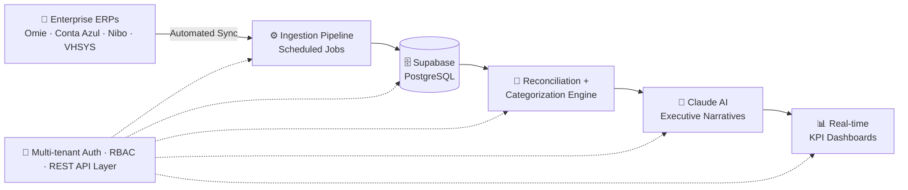
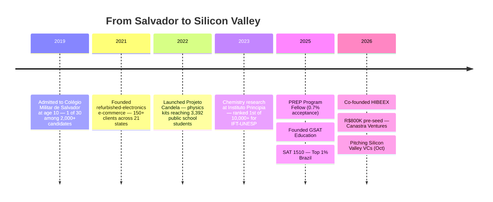

<div align="center">


<a href="https://github.com/gabrielmorenoribeiro-H">
  
</a>

<br/>


<br/><br/>

<a href="https://hibeex.com.br"></a>
<a href="https://linkedin.com/in/gabriel-moreno-ribeiro"></a>
<a href="mailto:gabrielmribeiro@hibeex.com.br"></a>
<a href="https://github.com/gabrielmorenoribeiro-H"></a>

<br/><br/>


</div>

---

## 💼 About Me

```typescript
const gabriel = {
  role: "Co-Founder & COO @ HIBEEX",
  origin: "Salvador, Bahia, Brazil 🇧🇷",
  education: ["LALA — Latin America Leadership Academy", "Fundação Estudar — PREP Program"],
  focus: ["Full Stack Engineering", "AI/LLM Products", "B2B FinTech"],
  languages: ["Português (native)", "English (fluent)", "Español (reading)"],
  mindset: "Ship fast → Measure impact → Iterate relentlessly",
};
```

I'm a **full stack and AI product engineer** building **HIBEEX**, a B2B financial intelligence platform that connects to enterprise ERPs (Omie, Conta Azul, Nibo, VHSYS), syncs financial data automatically, and runs **AI-powered cash-flow analysis** for small and medium businesses — replacing the manual spreadsheets they used before.

I architected and shipped the full-stack MVP end-to-end: **ERP-to-database sync pipelines, transaction reconciliation and categorization engines, multi-tenant auth with RBAC, REST API layers, automated ingestion jobs, Claude-powered executive narrative generation, and interactive KPI dashboards.**

Beyond code, I operate with a **product engineering mindset** — I've closed enterprise partnerships, raised **R$800K in pre-seed investment**, and shipped products used by some of the largest accounting operations in Brazil.

**🟣 Open To:** Software Engineering Internships · AI/ML Engineering Roles · Open Source Collaboration · Founder & VC Conversations

<br/>

<div align="center">

### ⚡ Impact at a Glance


</div>

---

## 🛠️ Tech Stack

### Languages
<p>

</p>

### Frontend
<p>

</p>

### Backend & Databases
<p>

</p>

### Cloud, DevOps & Tooling
<p>

</p>

---

## 🤖 AI / ML Expertise

| Domain | Proficiency | Details |
|:---|:---:|:---|
| **LLM Product Engineering** | ██████████ 95% | Claude API integration, executive narrative generation, AI-driven financial insights in production |
| **AI Data Pipelines** | █████████░ 90% | ERP data ingestion, transaction reconciliation & categorization engines with AI classification |
| **Personalization Algorithms** | ████████░░ 85% | Custom adaptive learning algorithm serving 71 students (GSAT Education) |
| **Scientific Computing** | ████████░░ 85% | SciPy differential equations, MATLAB modeling, Steady-State Approximation kinetics (97% accuracy) |
| **Applied Econometrics** | ███████░░░ 75% | Randomized Controlled Trial design & analysis (n=208), behavioral economics research |

---

## 🚀 Featured Projects

<details>
<summary><b>💜 HIBEEX — B2B Financial Intelligence Platform</b></summary>
<br/>

> AI-powered financial intelligence that connects to enterprise ERPs and turns raw accounting data into executive insights.

| Attribute | Details |
|:---|:---|
| **Stack** | Next.js · Supabase · Claude AI · REST APIs · PostgreSQL |
| **Scale** | ERP partnership with VHSYS (~20,000 clients) · Clients managing 600+ accounting bases |
| **Performance** | Automated ERP sync pipelines · Scheduled ingestion jobs · Interactive real-time KPI dashboards |
| **Security** | Multi-tenant authentication · Role-Based Access Control (RBAC) |
| **Impact** | R$800K pre-seed from Canastra Ventures (2.5% acceptance) · 12% revenue-share partnership |
| **Repository** | 🔒 Private (Proprietary) |

**🏗️ System Architecture**



Built the entire MVP solo as founding engineer: ERP-to-database synchronization pipeline, transaction reconciliation and categorization engine, multi-tenant RBAC auth, REST API layer, automated ingestion jobs, Claude-powered executive narrative generator, and interactive KPI dashboard. Serving major accounting market clients including the 6th largest Sistema Domínio user in Brazil. Selected as 1 of 6 startups for Canastra Ventures' AI residency — the youngest founding team in program history. Pitching to Silicon Valley VCs in October 2026.

</details>

<details>
<summary><b>📊 GSAT Education — Adaptive SAT Prep Platform</b></summary>
<br/>

> EdTech democratizing high-performance SAT preparation through mentorship + proprietary personalization technology.

| Attribute | Details |
|:---|:---|
| **Stack** | Custom personalization algorithm · 3,200+ annotated solutions database |
| **Scale** | 71 students mentored · International partnerships (Uzbekistan tech firm, sports hubs) |
| **Performance** | 53 of 71 students improved from ~900 to 1300+ SAT scores |
| **Security** | Student data privacy-first architecture |
| **Impact** | R$50,000+ revenue, bootstrapped with zero external capital, 100% reinvested |
| **Repository** | 🔒 Private (Proprietary) |

Founded and scaled an EdTech from zero: built a database of 3,200+ commented solutions and a proprietary personalization algorithm that adapts study paths per student. Closed strategic partnerships with an Uzbek technology company and athletic training centers (CT Nicolas Santos, CSA Authority) to reach student-athletes targeting US universities.

</details>

<details>
<summary><b>🔬 Projeto Candela — Physics Education Hardware Kits</b></summary>
<br/>

> Low-cost physics lab kits with QR-linked video lessons, deployed across public schools in Brazil.

| Attribute | Details |
|:---|:---|
| **Stack** | Hardware engineering · QR-linked video curriculum · Crowdfunding operations |
| **Scale** | 28 public schools · 3,392 students across Bahia & Ceará |
| **Performance** | Grades up 40% · Physics failure rate: 30% → 10% in 6 months |
| **Security** | N/A (Physical product) |
| **Impact** | Selected 1 of 14 among 700+ candidates — International Institute of Physics (IIP) |
| **Repository** | 🔒 Private |

Invested 100% of a PIBIC Jr/UFBA research grant (R$3,600) and raised R$8,000+ via crowdfunding to design and manufacture lab kits for 5 classic physics experiments. Personally pitched at 60+ schools. Presented at the International Institute of Physics and the Fundação Estudar Annual Conference.

</details>

<details>
<summary><b>📈 FinTech Savings RCT — Behavioral Economics Research</b></summary>
<br/>

> Randomized Controlled Trial measuring fintech tools' impact on savings behavior in public schools.

| Attribute | Details |
|:---|:---|
| **Stack** | RCT experimental design · Statistical analysis · Behavioral economics frameworks |
| **Scale** | 208 public school students |
| **Performance** | +130% total savings in treatment group |
| **Security** | Anonymized participant data |
| **Impact** | Public policy recommendations for Brazil's National Curriculum (BNCC) |
| **Repository** | 📄 Research Publication |

Conducted under direct supervision of Dr. Aaron Litvin (Ph.D., Harvard) through Fundação Estudar's PREP Program (0.7% acceptance). Authored a paper on behavioral biases and nudge theory with actionable public policy recommendations.

</details>

<details>
<summary><b>⚗️ Chemical Kinetics Modeling — Instituto Principia</b></summary>
<br/>

> Computational modeling of complex reaction mechanisms via Steady-State Approximation.

| Attribute | Details |
|:---|:---|
| **Stack** | MATLAB · SciPy (Differential Equations) · ChemDraw · Avogadro · LaTeX |
| **Scale** | 59-page thesis · Haber-Bosch synthesis & stratospheric ozone decomposition simulations |
| **Performance** | 97% simulation accuracy |
| **Security** | N/A (Academic research) |
| **Impact** | Ranked #1 of 10,000+ candidates for IFT-UNESP |
| **Repository** | 📄 Published Research · 🎥 YouTube Presentation |

Researched Chemical Kinetics under Dr. Juliano Bonacin (Ph.D., USP — #1 in Latin America), modeling the Steady-State Approximation for complex reaction mechanisms with production-grade scientific computing tooling.

</details>

---

## 💼 Experience

### **Co-Founder & COO** · HIBEEX
`São Paulo, BR | 2026 — Present`

B2B financial intelligence platform connecting to enterprise ERPs for AI-powered cash-flow analysis.

- Architected and shipped the full-stack MVP: ERP sync pipelines, reconciliation engine, multi-tenant RBAC, REST APIs, Claude-powered insights, KPI dashboards
- Closing a 12% revenue-share partnership with VHSYS (~20,000 clients)
- Raised R$800K pre-seed from Canastra Ventures (1 of 6 startups, 2.5% acceptance) — youngest founding team in program history
- Interviewing for WOW Accelerator Batch #34 (Brazil's largest accelerator, R$500K potential)

`Next.js` `Supabase` `Claude AI` `PostgreSQL` `REST APIs` `RBAC`

### **Co-Founder & CEO** · GSAT Education
`USA & Brazil (Remote) | Oct 2025 — Present`

EdTech democratizing elite SAT preparation.

- Generated R$50K+ revenue bootstrapped, 100% reinvested
- Built 3,200+ solution database and proprietary personalization algorithm
- Mentored 71 students; 53 improved from ~900 to 1300+

`EdTech` `Algorithms` `Product` `Partnerships`

### **Founder & Chief Engineer** · Projeto Candela
`Salvador, BR | Jun 2022 — Present`

Physics education hardware for public schools.

- Deployed kits in 28 public schools reaching 3,392 students
- Grades up 40%; failure rate cut from 30% to 10%

`Hardware` `Education` `Crowdfunding` `Operations`

### **Researcher — Economics** · Fundação Estudar (PREP Program)
`Brazil (Remote) | Jan 2025 — Apr 2026`

- Selected among ~70 fellows from 10,000+ candidates (0.7% acceptance)
- Ran an RCT (n=208) showing +130% savings under Harvard Ph.D. supervision

`Econometrics` `RCT Design` `Behavioral Economics`

### **Researcher — Chemistry** · Instituto Principia
`Brazil (Hybrid) | Jun 2023 — Jun 2025`

- Modeled complex reaction kinetics with 97% simulation accuracy (59-page thesis)
- Ranked #1 of 10,000+ candidates for IFT-UNESP

`MATLAB` `SciPy` `Scientific Computing` `LaTeX`

### **Founder & Operations Manager** · E-Commerce (Refurbished Electronics)
`Salvador, BR (Remote) | Jan 2021 — Dec 2024`

- Imported, repaired, and shipped hardware to 150+ clients across 21 Brazilian states
- Generated ~USD 7,000 in revenue; reinvested 75% in education

`Hardware Repair` `Logistics` `E-Commerce`

---

## 🛤️ The Journey



---

## 🏆 Achievements

<div align="center">

| Recognition | Details |
|:---|:---|
| 🥇 **39 Olympiad Medals (19 Gold)** | Across 49 science olympiads · 7,000+ study hours · 2 international awards |
| 🧪 **IChO National Finalist** | International Chemistry Olympiad Brazilian selection |
| 🥇 **Gold — National Science Olympiad (ONC)** | Plus Gold: ONNEQ, OBB (Biotech), OMEM, OQJ, 2× ONEE, 2× Math Sans Frontières Intl |
| 💰 **R$1.5M+ in Merit Scholarships** | Full scholarships at Brazil's top 4 prep schools (Ari de Sá, Farias Brito, Poliedro, Estratégia) |
| 🎓 **PREP Program — Fundação Estudar** | 1 of ~70 fellows selected from 10,000+ candidates nationwide (0.7% acceptance) |
| 📊 **SAT 1510/1600** | Math: 780 (98th percentile global) · Top 1% in Brazil |
| 🏛️ **Colégio Militar de Salvador** | Admitted at age 10 — 1 of 30 selected from 2,000+ candidates · "Alamar" distinction 5 consecutive years |
| 🚀 **Canastra Ventures AI Residency** | 1 of 6 startups selected (2.5% acceptance) · Youngest founding team in history |

</div>

---

## 📜 Certifications

### ☁️ AWS


### 🎓 Schoolhouse by Khan Academy


### 🌐 Language Proficiency


---

## 👨‍💻 Coding Profiles

<div align="center">

<a href="https://leetcode.com/gabrielmorenoribeiro"></a>
&nbsp;
<a href="https://www.hackerrank.com/gabrielmorenoribeiro"></a>
&nbsp;
<a href="https://www.codechef.com/users/gabrielmoreno"></a>
&nbsp;
<a href="https://www.geeksforgeeks.org/user/gabrielmorenoribeiro"></a>

</div>

---

## 📊 GitHub Analytics

<div align="center">


<br/><br/>


<br/><br/>


<br/><br/>


</div>

---

## 🏅 GitHub Trophies

<div align="center">


</div>

---

## 📈 Contribution Activity

<div align="center">


</div>

---

## 🐍 Contribution Snake

<div align="center">

<picture>
  <source media="(prefers-color-scheme: dark)" srcset="https://raw.githubusercontent.com/gabrielmorenoribeiro-H/gabrielmorenoribeiro-H/output/github-contribution-grid-snake-dark.svg" />
  <source media="(prefers-color-scheme: light)" srcset="https://raw.githubusercontent.com/gabrielmorenoribeiro-H/gabrielmorenoribeiro-H/output/github-contribution-grid-snake.svg" />
  
</picture>

</div>

---

## 🎯 Current Focus

```yaml
learning:
  - Advanced LLM orchestration & agentic workflows
  - Distributed systems & scalable data pipelines
  - Leadership & entrepreneurship @ LALA (Latin America Leadership Academy)

building:
  - HIBEEX — AI-powered B2B financial intelligence platform
  - ERP integrations expansion (VHSYS partnership, ~20K clients)
  - GSAT Education — adaptive SAT prep engine

exploring:
  - AI applications in FinTech & accounting automation
  - Behavioral economics × product design

open_to:
  - Software Engineering Internships
  - AI/ML Engineering Roles
  - Open Source Collaboration
  - Founder & Investor Conversations

next_stop: "Silicon Valley — October 2026 🚀"
```

---

## 🤝 Connect

<div align="center">

<a href="mailto:gabrielmribeiro@hibeex.com.br"></a>
<br/>
<a href="https://linkedin.com/in/gabriel-moreno-ribeiro"></a>
<br/>
<a href="https://github.com/gabrielmorenoribeiro-H"></a>
<br/>
<a href="https://hibeex.com.br"></a>

</div>

---

<div align="center">


### *"Ship fast. Measure impact. Iterate relentlessly."*


</div>lorList=6,12,20&height=120&section=footer" width="100%"/>

</div>


</div>
